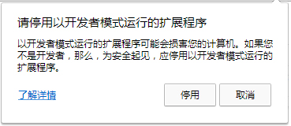
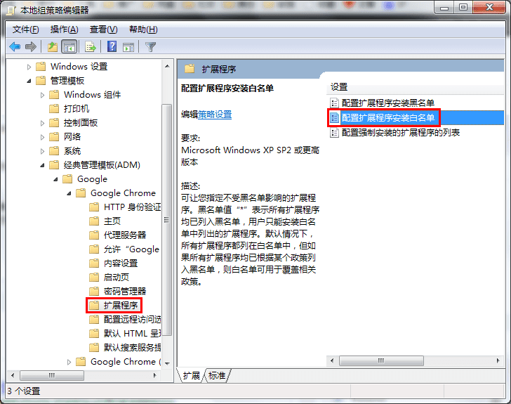

## 屏蔽Google Chrome安装第三方插件之后反复提示“请停用以开发者模式运行的扩展程序”解决方案

Google Chrome 33版本之后基于安全的原因屏蔽了第三方插件的安装，虽然打开开发者模式之后可以成功安装，但每次启动浏览器的时候都会出现“请停用以开发者模式运行的扩展程序”的提示，只有每次点击取消之后才能正常使用扩展，这对于一些优秀的第三方插件或者自己修改的一些插件来说简直是一种灾难。

后来终于查到了在Windows下使用组策略添加扩展程序白名单的方式屏蔽了这种提示，操作如下：
1. 首先下载Chrome组策略管理模板 chrome.adm 下载地址：[chrome.adm](./resource/chrome.adm)
2. 然后打开“本地组策略编辑器”（在运行中执行 gpedit.msc或者在控制面板-管理工具中打开），在“计算机配置”-“管理模板”中右键选择“添加/删除模板”安装刚才的那个chrome.adm文件，安装成功之后就可以在“管理模板”-“经典管理模板（ADM）”-“Google”下面看到“Google Chrome”了。这里需要说明两点，一是这个下面可能会有两个Google Chrome，一个有推荐字样，看看哪个下面有“扩展程序”，通常是不带推荐的那个；另外一点是按照chrome.adm的过程中如果策略编辑器长时间停止响应的话可以强制将其关闭之后在打开就可以了，不影响后面的操作。
3. 接下来选择“扩展程序”，然后双击右侧的“配置扩展程序安装白名单”，如下图：

4. 打开之后首先选择左边的”已启用“，然后选择下面的 显示 按钮，将安装之后的第三方插件的ID（打开Google Chrome的开发者模式之后会显示）输入到刚才的白名单对话框中确定保存即可。

另外需要说明的是，这种情况下需要一直打开”开发者模式“，另外如果直接在开发者模式下通过加载插件开发目录形式加载插件也无效的话可以将其打包之后再安装就可以了，不过打包再安装之后其ID会发生变化。